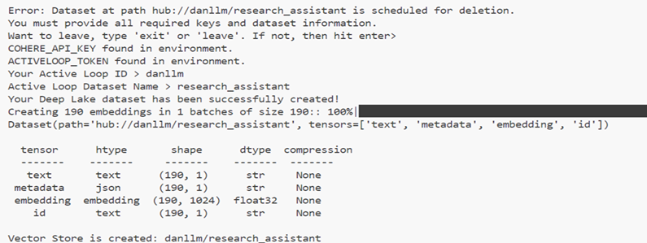

## **Research Assistant**

The project leverages on Large Language Models (LLMs) and prompt engineering to create a research assistant that gives answers to your question based on what is available in the vector data base store on your deeplake account.


### **How the project goes**
- All files can only after installing all dependencies in the `environment.yml` file
- The `notebook folder` contains the jupyter notebook file for testing the project as a whole and for experimenting
- The `vector_database_creation.py` file is for creating the vector database resource for the LLM
- The `rag_research_assistant_main.py` file is the main drivver code for the research assistant
- The initial data resources for the database creation can be found in the `research_articles.zip` file

### **Replicating this project**
Before installing the dependencies in the `environment.yml` file. Kindly do the following first
- Download and install &nbsp;[Anaconda](https://www.anaconda.com/products/distribution#Downloads)
    - Once Conda is installed, open your CMD and run the following command `C:/Users/your_system_name/anaconda3/Scripts/activate`
    - Should see something like `'(anaconda3)'C:\Users\your_system_name\Desktop\>` as an output in your CMD
        > NB: Do not close the CMD terminal, would be needed later on 
- Sigup for Cohere &nbsp;[Cohere](https://dashboard.cohere.com/welcome/register)
    - Once your account is created,  navigate to API keys in your profile and create Trial Cohere API key. **BE SURE TO COPY IT** 
- Sigup for Active Loop (Your vector database) &nbsp;[Active Loop](https://auth.activeloop.ai/login?state=hKFo2SBKYUtqVlRvQ2hxc3lVUFFrb0ZpYzdDVkk1ZDczT3lGcKFupWxvZ2luo3RpZNkgRzdpSlB1T0lxOVRISzFsN0dKX052TnlFWE0zS1U2VWWjY2lk2SA1c2t5dUdsaGRPOWFQS0dVNmtFVDhMeDl4MjdLN1dOeQ&client=5skyuGlhdO9aPKGU6kET8Lx9x27K7WNy&protocol=oauth2&scope=openid%20profile%20email&redirect_uri=https%3A%2F%2Fapp.activeloop.ai&audience=https%3A%2F%2Fapp.activeloop.ai&response_type=code&response_mode=query&nonce=cGlOblp0WWRseW93aU5hOWhtRlVmNktyUjhrUHdkWVJ6Yk1RLk9HcmJwRw%3D%3D&code_challenge=fAJ2KXvgmirNnBrRoNv4WfyghWzkweeLgJr07eSpOak&code_challenge_method=S256&auth0Client=eyJuYW1lIjoiYXV0aDAtcmVhY3QiLCJ2ZXJzaW9uIjoiMi4yLjQifQ%3D%3D)
    - Once your account is created,  navigate to API tokens in your profile and create your API token. **BE SURE TO COPY IT** 
- Sign up for Hugging face (Access to models) &nbsp;[Huggingface](https://huggingface.co/)
    - Once your account is created, navigate to access tokens and create an access token of `read only`. **BE SURE TO COPY YOUR ACCESS TOKEN** 

### **Creating your virtual environment**
- Navigate to your desktop and create a new folder called `research_assistant` and paste the `environment.yml` file into the folder
- On your cmd navigate into the `research_assistant` folder using `cd research_assistant`
- Run `conda env create -f environment.yml -p ../research_assistant/rag` on your cmd 
- Run `conda env list` on your cmd to list all environments created using Anaconda
- Run `conda activate C:\Users\your_system_name\Desktop\research_assistant\rag` on your cmd to activate the environment
    - Should see something like `'(rag)'C:\Users\your_system_name\Desktop\research_assistant>` as an output in your CMD
- Run `conda list`  on your cmd to check if all dependencies have been installed

### **Running your research assistant**
- Paste all your tokens in the .env file
- Activate your conda environment as previously shown
    - `'(anaconda3)'C:\Users\your_system_name\Desktop\>`
    - `conda activate C:\Users\your_system_name\Desktop\research_assistant\rag`
- Navigate to the folder of your project; `research_assistant` using `cd  research_assistant`
- Navigate to the folder of your project; `vector_base_creation` using `cd  vector_base_creation`
- Run `python vector_database_creation.py` to create your vector database
- Navigate to the folder of your project; `rag_research_assistant` using `cd  rag_research_assistant`
- Run `python rag_research_assistant_main.py` to run your research assistant.

For example prompts, refer to prompts.md

### **Example Usage**
When `vector_database_creation.py` is ran, the following output is given when all criteria are met



When `rag_research_assistant_main.py is ran, the following example output is given

**Question**

`Why did Mehedi Tajrian analyse child development and what was the best classifier?`

**Answer**
```
Mehedi Tajrian analyzed child development due to:
    - The rapid spread of misinformation online complicating accurate decision-making, especially for parents.
    - The lack of research into distinguishing myths and facts about child development using text mining and classification models.
    - The potential risks of inaccurate information on child treatment and development.
    - To provide valuable insights for making informed decisions, thus aiding parents in handling misinformation.
    -To shed light on myths around child development and aid in making informed decisions. These include several stages, including data pre-processing through text mining techniques, and analysis with six traditional machine learning classifiers and one deep learning model using two feature extraction techniques.
    -The best performing classifier is the Logistic Regression (LR) model with a 90% accuracy rate. The model also stands out for its speed and efficiency, with very low testing times per statement, and demonstrated robust performance on both k-fold and leave-one-out cross-validation.
Source(s):
- Title: Analysis of child development facts and myths using text mining techniques and classification models, Page: 1
- Title: Analysis of child development facts and myths using text mining techniques and classification models, Page: 15
- Title: Analysis of child development facts and myths using text mining techniques and classification models, Page: 2
```

Here is the Publication on;
- [LinkedIn](https://www.linkedin.com/posts/daniel-ihenacho-637467223_nlp-datascience-genai-activity-7338907748442456066-wNcZ?utm_source=share&utm_medium=member_desktop&rcm=ACoAADgheMsBhliqOiWzMQCs2pi9jfojo2pW168) 
- [ReadyTensor](https://app.readytensor.ai/publications/research-assistant-LstceSnb3IDH)

### Issues faced:
I did experience an [issue](https://github.com/langchain-ai/langchain/issues/31434) from the huggingface platform but was solved thanks to the open source community! Highly grateful to you all!

Happy prompting and may the RAG be with you young JEDI!